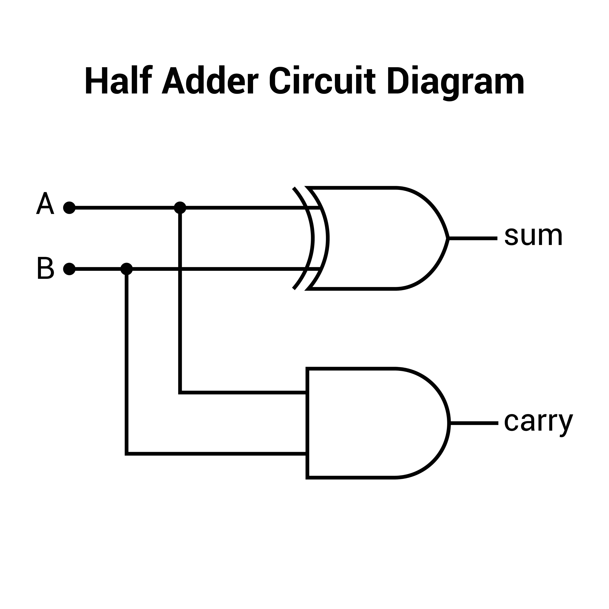

XOR отвечает за сравнение неравенства
0 ^ 0 | 0  0 ^ 1 | 1 (взаимное исключение)  1 ^ 0 | 1 (взаимное исключение) 1 ^ 1 | 0 
XNOR за сравнение равенства. 
0 ^ 0 | 1 0 ^ 1 | 0 1 ^ 0 | 0 1 ^ 1 | 1 
синтаксис XNOR: `~^` или `==`

# Полусумматор (Half Adder)

A, B - inputs 1 bit number. 
sum, carry - output 1 bit number
Getting sum with a carry: 
0 + 0  =   **0**,carry **0**  0 + 1  =   **1**, carry **0**  1 + 0  =   **1**, carry **0** 1 + 1  =   **1**, carry **1**
		|           |
       XOR      AND