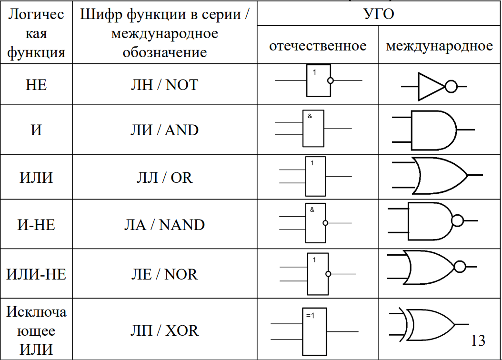

XOR отвечает за сравнение неравенства
0 ^ 0 | 0  0 ^ 1 | 1 (взаимное исключение)  1 ^ 0 | 1 (взаимное исключение) 1 ^ 1 | 0 
XNOR за сравнение равенства. 
0 ^ 0 | 1 0 ^ 1 | 0 1 ^ 0 | 0 1 ^ 1 | 1 

синтаксис XNOR: `~^` или `==`

